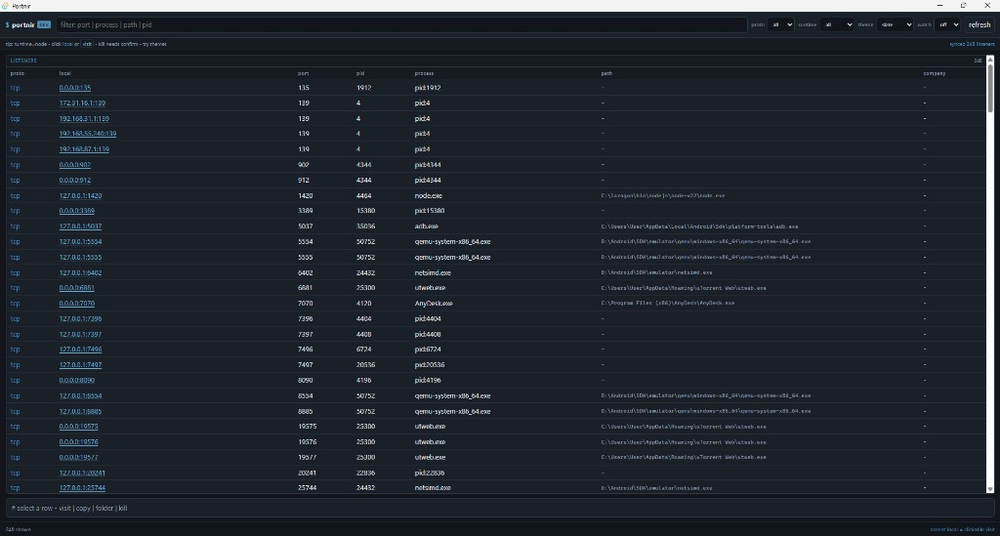

<div align="center">


# Portnir

### See what is listening on your Windows PC — without drowning in netstat noise.

[](https://github.com/cyrstrstn/portnir/releases/latest)
[](https://github.com/cyrstrstn/portnir/actions/workflows/release.yml)
[](LICENSE)
[](https://github.com/cyrstrstn/portnir/releases/latest)
[](#privacy-and-safety)
[](#why-portnir)

**A small, open-source Windows listening-port viewer with a desktop UI, a matching CLI, and zero background services.**

Portnir (port + Norse *-nir*) answers: *which process owns this local port?* Local machine only — no remote scanning, no accounts, no telemetry.

[Install](#one-command-install) · [Screenshot](#screenshot) · [Scripts blocked?](#if-scripts-are-blocked-executionpolicy) · [Commands](#commands) · [Build](#build-from-source) · [Releases](https://github.com/cyrstrstn/portnir/releases)

</div>

---

## Screenshot

<div align="center">



<sub>Desktop UI: filter listeners, switch themes, visit / copy / folder / kill</sub>

</div>

---

## One-command install

Open **Windows PowerShell** and paste:

```powershell
irm https://raw.githubusercontent.com/cyrstrstn/portnir/main/scripts/irm-install.ps1 | iex
```

Open a **new** terminal, then:

```powershell
Portnir          # desktop UI
portnir list     # CLI
```

> [!NOTE]
> Installation is per-user and does **not** need Administrator. Files go under `%LOCALAPPDATA%\Programs\Portnir`, and your user `PATH` is updated. The remote installer runs **in memory** (it does not leave a blocked `.ps1` on disk). Requires a published GitHub release that includes `Portnir-Windows.zip`.

### If scripts are blocked (ExecutionPolicy)

Some PCs show errors like:

- `running scripts is disabled on this system`
- `File cannot be loaded because running scripts is disabled`
- `UnauthorizedAccess` / ExecutionPolicy

Use this **one paste** instead. It only bypasses policy for that install command. It does **not** permanently change your PC policy:

```powershell
powershell -NoProfile -ExecutionPolicy Bypass -Command "irm https://raw.githubusercontent.com/cyrstrstn/portnir/main/scripts/irm-install.ps1 | iex"
```

**Windows Terminal / PowerShell tip:** paste the whole line, press Enter, wait until you see `Portnir installed successfully`, then open a **new** tab/window before running `Portnir` / `portnir`.

You do **not** need `Set-ExecutionPolicy RemoteSigned` (or any permanent policy change) to install Portnir.

### Update

Run the same install command again (normal `irm ... | iex`, or the Bypass line if scripts are blocked). It downloads and installs the latest GitHub release.

### Manual installation

1. Download [`Portnir-Windows.zip`](https://github.com/cyrstrstn/portnir/releases/latest/download/Portnir-Windows.zip) from [Releases](https://github.com/cyrstrstn/portnir/releases/latest).
2. Or grab **`Portnir-Setup.exe`** (NSIS installer) from the same release if you prefer a classic setup wizard.
3. Extract the zip, then open PowerShell **in that folder** and run:
   ```powershell
   powershell -NoProfile -ExecutionPolicy Bypass -File .\install.ps1
   ```
   If scripts are not blocked on your PC, `.\install.ps1` also works.

Zip contents:

| File | Purpose |
|---|---|
| `Portnir.exe` | Desktop UI |
| `portnir.exe` | CLI |
| `LICENSE` / `README.md` | Docs |
| `install.ps1` | Local installer |

## Why Portnir?

| | Portnir |
|---|---|
| Focus | Listening TCP / UDP binds (not every established connection) |
| Distribution | Zip + optional Setup.exe from GitHub Releases |
| UI | Tauri 2 + React (system WebView2) |
| CLI | Matching `portnir` binary |
| Themes | terminal · slate · paper · amber |
| Background service | None |
| Accounts or cloud | None |
| Telemetry | None |
| Kill | Confirm in GUI, or `--yes` on CLI — listener PIDs only |
| License | MIT |

Portnir uses a shared Rust core (`portnir-core`). The GUI and CLI call the same enumeration and kill logic.

## What it shows

- Listening **TCP** endpoints and bound **UDP** sockets
- Local address, port, PID, process name, and image path
- Search across protocol, address, port, process, path, and PID
- Protocol filter (all / TCP / UDP)
- Runtime filter (Node, Python, Java, .NET, PHP, Ruby, Go, Rust)
- Auto-refresh (off / 2s / 5s / 10s)
- **Visit** — open a loopback / private-LAN HTTP URL in the system browser (`0.0.0.0` → `127.0.0.1`)
- **Copy** — clipboard line for the selected listener
- **Folder** — reveal the process path in Explorer
- **Kill** — terminate with confirmation (GUI) or `--yes` (CLI)

## Desktop app

Toolbar:

| Control | Purpose |
|---|---|
| filter | Free-text search |
| proto | all / tcp / udp |
| runtime | Language / runtime heuristics |
| theme | terminal / slate / paper / amber (saved) |
| watch | Auto-refresh interval |
| refresh | Manual sync |

Select a row for **visit**, **copy**, **folder**, and **kill**. Accent-colored local addresses are clickable when visit is allowed.

For local development from a clone, prefer:

```powershell
.\scripts\dev-desktop.ps1
```

> [!NOTE]
> Prefer `.\scripts\dev-desktop.ps1` over bare `npm run tauri dev`. On Windows, Tauri can tear down Vite and leave a blank “localhost refused” window. Do **not** open `http://127.0.0.1:1420` in Chrome for normal use.

## Commands

| Command | Purpose |
|---|---|
| `portnir list` | List listening endpoints |
| `portnir list --tcp` | TCP only |
| `portnir list --udp` | UDP only |
| `portnir list --json` | JSON output for scripts |
| `portnir check <port>` | Show owners of a port (or “nothing listening”) |
| `portnir check <port> --json` | JSON for one port |
| `portnir kill <pid> --yes` | Kill a PID that owns a current listener |
| `portnir --help` | Show help |
| `portnir --version` | Print version |

```powershell
portnir list --tcp
portnir check 135
portnir kill 12345 --yes
```

## Privacy and safety

- Every scan runs locally on the current PC.
- Portnir does not upload system information.
- There are no analytics, advertisements, accounts, or tracking identifiers.
- Nothing runs automatically when Windows starts.
- There is no resident agent or background service.
- Enumeration is read-only. Kill only runs when you confirm in the UI or pass `--yes` on the CLI, and only for PIDs that currently own a listening endpoint.
- **Visit** only opens `http(s)` to loopback or private LAN hosts.

## Build from source

### Prerequisites

| Tool | Purpose |
|---|---|
| [Rust](https://rustup.rs/) (stable) | Core, CLI, Tauri backend — put `%USERPROFILE%\.cargo\bin` on `PATH` |
| [Node.js](https://nodejs.org/) (LTS) | Vite + React UI |
| [WebView2](https://developer.microsoft.com/microsoft-edge/webview2/) | Tauri window |
| MSVC C++ Build Tools | Link Windows crates (*Desktop development with C++*) |

```powershell
git clone https://github.com/cyrstrstn/portnir.git
cd portnir
$env:PATH = "$env:USERPROFILE\.cargo\bin;$env:PATH"
.\scripts\dev-check.ps1
.\scripts\dev-desktop.ps1
```

### Make a release zip locally

```powershell
.\scripts\build-release.ps1
# → release\Portnir-Windows.zip
# → release\Portnir-Setup.exe  (if NSIS built)
```

Tagging `v*` on GitHub runs the same packaging in CI and publishes a release.

## Project structure

```text
apps/desktop/                 Tauri 2 + React + TypeScript UI
crates/portnir-core/          Windows IP Helper enumerate + kill
crates/portnir-cli/           portnir CLI binary
scripts/irm-install.ps1       Public one-command installation entry point
scripts/install.ps1           Local and GitHub release installer
scripts/build-release.ps1     Zip + Setup packaging
scripts/dev-desktop.ps1       Stable Vite + Tauri launcher
scripts/dev-check.ps1         Core tests + CLI smoke
.github/workflows/release.yml Tagged-release automation
```

## Contributing

Issues and pull requests are welcome. Please keep additions aligned with the project principles:

1. Stay focused on local listening ports and clear remediation actions.
2. Prefer Windows-native information sources (IP Helper / process APIs).
3. Keep destructive actions explicit and confirmed.
4. Keep CLI and GUI behavior consistent via `portnir-core`.
5. Never add telemetry or hidden network communication.

## License

Portnir is open source under the [MIT License](LICENSE).

<div align="center">

Built for developers who need to know what is bound — fast.

</div>
